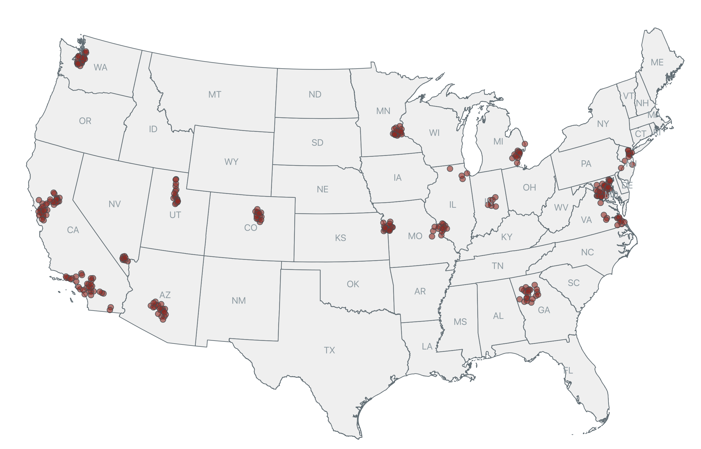
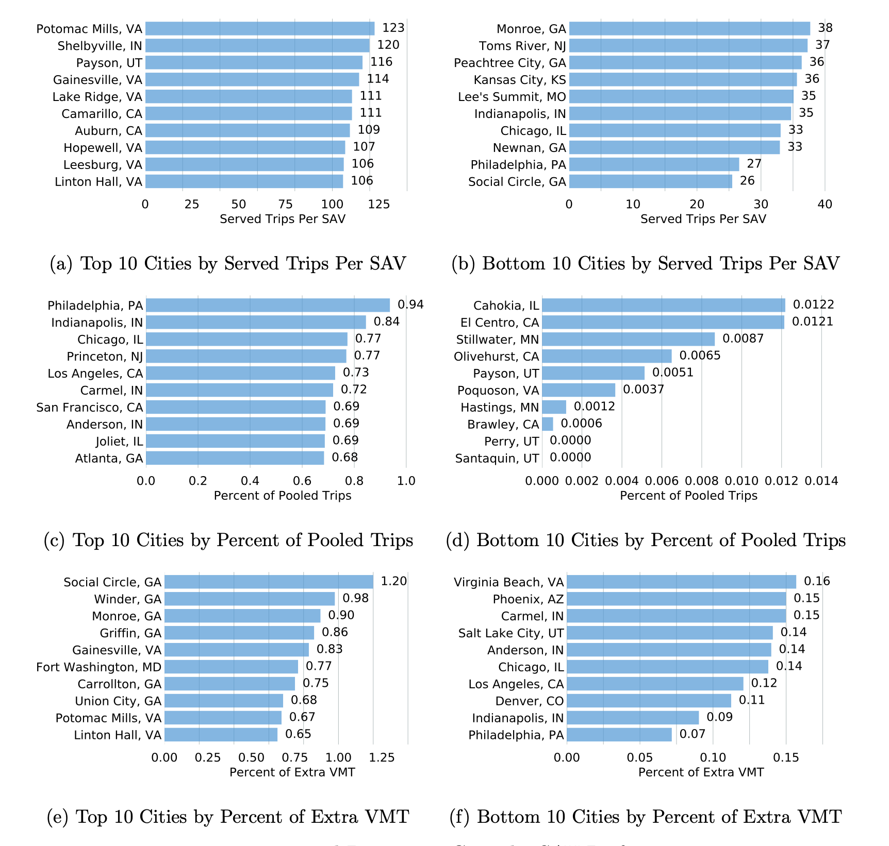
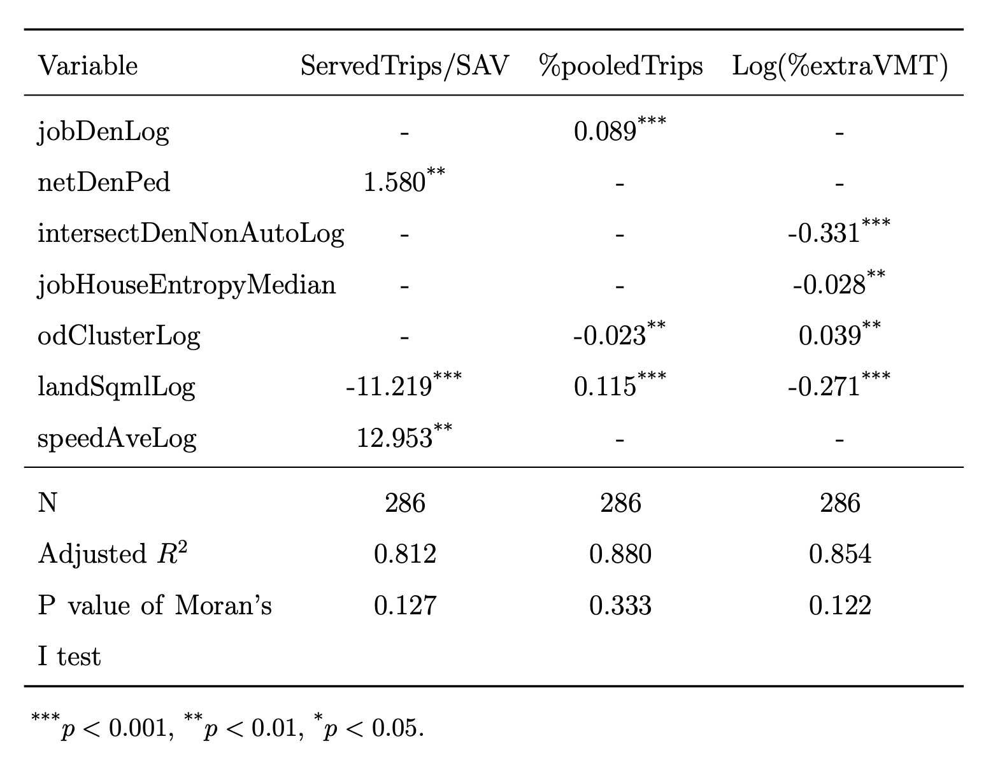
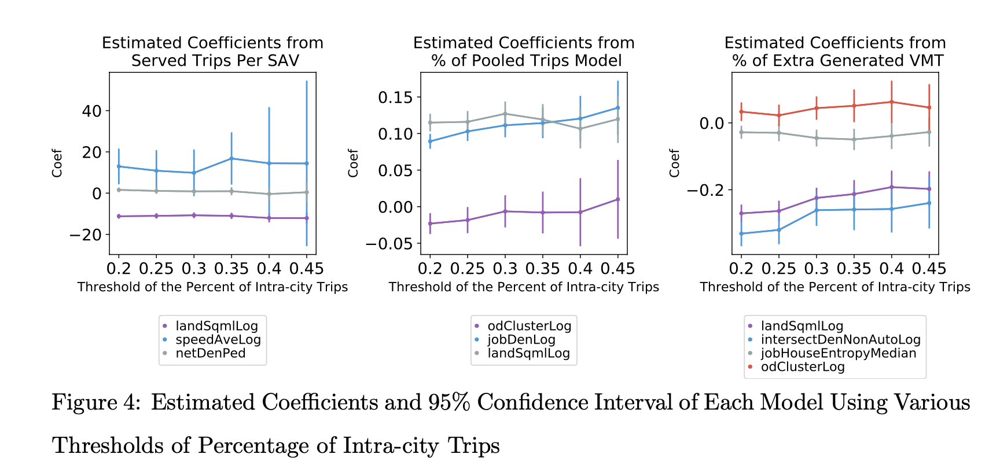
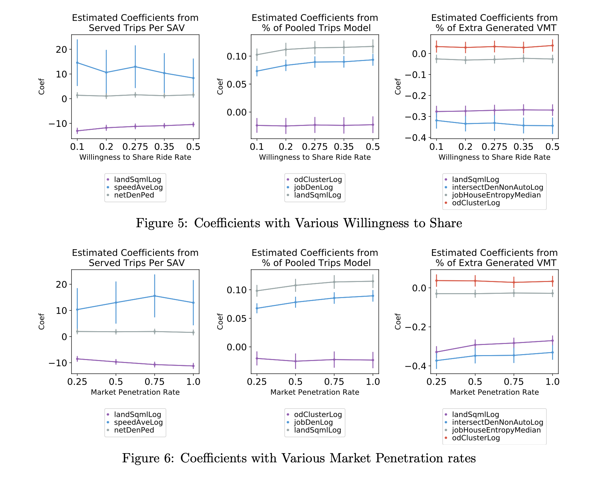

# Urban Form and Shared Autonomous Vehicles
This project explores the impact of urban form on the performance of the envisioned Shared Autonomous Vehicle (SAV) system (i.e., taxi without drivers). Limited sutdies, to date, have systematically examined the impact of urban form, such as desntiy, land use diversity, and design on the performance of SAV. 

## Method
We used an agent-based simulation and fixed effect regression models to explore the impact of urban form measurements on the performance of SAV systems. We first assess the performance of SAV systems across cities using an agent-based SAV simulation (Zhang et al., 2017). Specifically, the perforamnce metrics we examiend include he number of served trips per SAV, the percent of pooled trips, and the percent of extra VMT. We simulated SAV perforamnce in 286 cities from the service areas of 21 Metropolitan Planning Organizaitons (MPOs). We then developed fixed effects models to understand the role of urban form on SAV performance. 

### SAV simualtion and city selection. 
The SAV simulator used in this study is developed by Dr. [Wenwen Zhang](https://wenwenz.com/) and Dr. [Subhrajit Guhathakurta](https://planning.gatech.edu/people/subhro-guhathakurta). We collected data from 21 MPOs and identified 286 cities that has over 10 Traffic Analysis Zones (TAZs) and 20% of the intra-city trips, as shown in the map below. 

The SAV service bounrday are identified by aligning the TAZ, blockgroup, and city administration boundaries using the script: .py and the resulted shapefile of city servcie boundaries can be found under the service_bo folder. 

### Urban form variables.
We used convetional urban form varialbes, such as density, land use diversity, and design variables, as the indepdent variables for this study. In addition, we also used travel demand weighted global clustering coefficient to measure urban centrality, a variable that is widely used in the urban morphology literature. 

### Fixed effect regression models.
We then developed fixed effect regression models across SAV performance metrics, with regioanl dummy variables. 

## Results
### SAV performances
The performance of SAV systems are displayed in the following chart and a complete list of performance metrics can be found in the sav_performance.csv file under the results folder. 

### Fixed effect regression model
The fixed effect model results are as follows:

### Sensitivity tests
We also conducted sensitivity tests for different city selection criteria, levels of SAV market penetration, and level of willingness to share and the results are consistent across scenarios. 
#### Sensitivity test - % of intra city trip
The results are consistent across different thresholds for the percent of intract city trips. The standard devitations of the estimated coefficients become larger as the sample size diminishes with the increase of threshold of the percent of intra-city trips

#### Sensitivity test - willingness to share and market penetration
The results suggest the estimated coefficients are also consistent across different levels of willingness to share and market penetration rates.

## Conclusions
Our results show that urban form can significnatly impact the perforamnce of SAV systems. The modeling results suggest that urban form can significantly influence the performance of SAVs. Specifically, the pedestrian-oriented network density and intersection density can reduce extra VMT generation and improve SAV efficiency. Besides, policies that encourage more compact employment distributions may effectively increase trip pooling success rates. Land use policies increasing land use diversity (i.e., higher job-house entropy) and supporting multi-core development (i.e., lower travel demand weighted global clustering coefficient) may also promote SAV performance.The results also suggest that local congestion levels may have a negative impact on the number of person trips served per SAV. Therefore, land use policies that encourage compact development may be bundled with travel demand management strategies, such as alternative travel mode promotion policies that mitigate local congestion, to enhance the efficiency of SAVs.

## Acknolwedgements
We thank the MPOs who provide us with the travel demand model output. These MPOs include Hampton Roads Transportation Planning Organization (HRTPO), Metropolitan Transportation Commission (MTC), National Capital Region Transportation Planning Board (TPB), Wasatch Front Regional Council, Metropolitan Council, Chicago Metropolitan Agency for Planning (CMAP), Maricopa Association of Governments (MAG), Regional Transportation Commission of Southern Nevada (RTC), Puget Sound Regional Council (PSRC), Southeast Michigan COG (SEMCOG), Atlanta Regional Commission (ARC), Indianapolis MPO, East-West Gateway Council of Government (EWGCOG), Richmond Area MPO, Delaware Valley Regional Planning Commission (DVRPC), North Jersey Transportation Planning Authority (NJTPA), Sacramento Area COG (SACOG), Baltimore Regional Transportation Board (BRTB), Denver Regional COG (DRCOG), Southern California Association of Governments (SCAG), Mid-America Regional Council (MARC). Some travel demand model results are not used due to a lack of access to software or data inconsistency issues but we thank the MPOs who shared them with us including North Central Texas COG (NCTCOG), METROPLAN Orlando, Southeastern Wisconsin Regional Planning Commission (SEWRPC), Memphis Urban Area MPO, state-planning council in State of Rhode Island, Southwestern Pennsylvania Commission (SPC), and Ulster County Transportation Council. 

## Research Team
[Wenwen Zhang](https://wenwenz.com/) 
Assistant Professor 
Public Informatics 
Rutgers, the State University of New Jersey 
E-mail: wenwen.zhang@ejb.rutgers.edu 
 
Kaidi Wang 
Ph.D. Student 
Urban Affairs and Planning 
Virginia Polytechnic Institute and State University 
E-mail: kaidi@vt.edu 